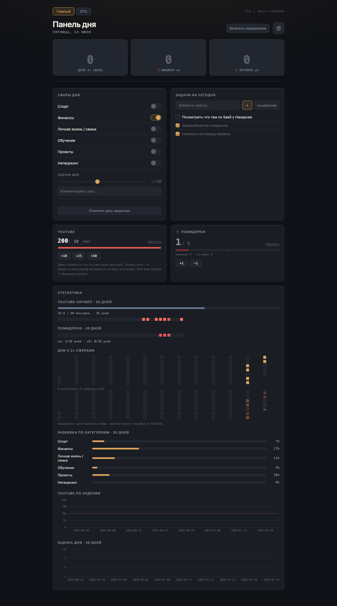
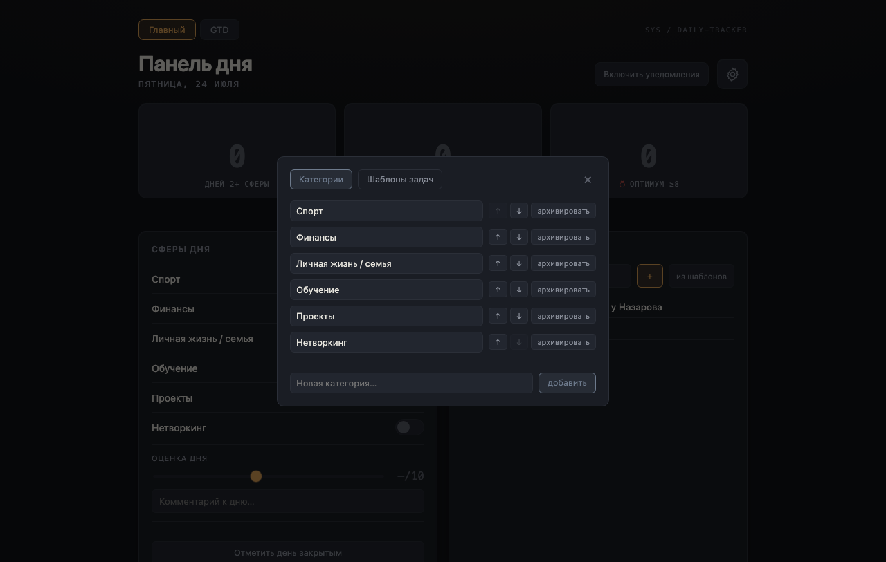
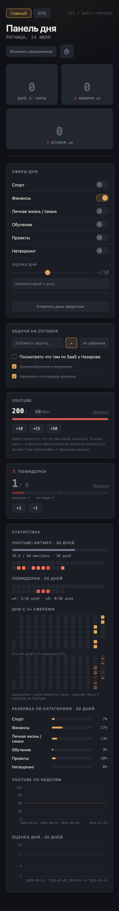
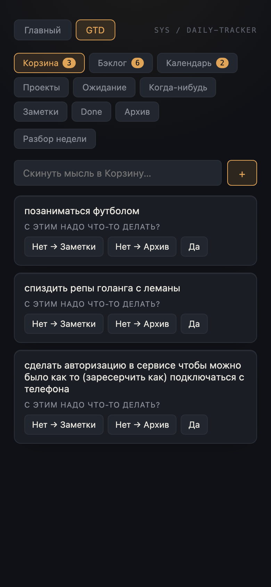
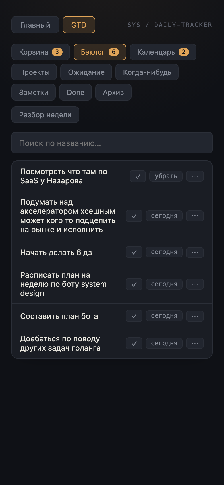
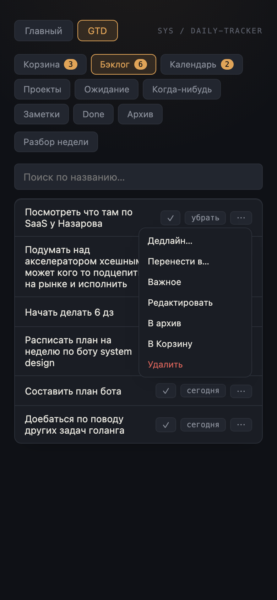
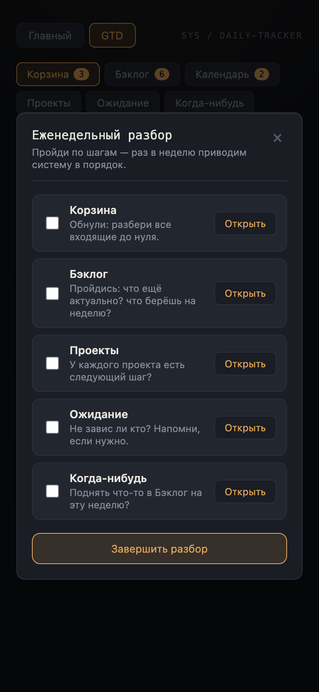

# Полное дизайн- и продуктовое ревью — 2026-07-24 (весь проект)

**Что ревьюим:** весь трекер целиком — Главный экран, GTD (все бакеты + Weekly Review + новый календарь), Настройки — на **десктопе и на реальной мобильной эмуляции** (390×844, честный CDP `Emulation.setDeviceMetricsOverride`, не фиктивный `--window-size`, который в headless Chrome не работает — первая попытка это подтвердила: `innerWidth` вышел 500 вместо 390).

**Метод:** живые скриншоты запущенного стенда, полные страницы (`Page.captureScreenshot` с `captureBeyondViewport`), плюс точечная проверка кода (CSS-токены, тач-таргеты) и `scrollWidth`/`innerWidth` для проверки горизонтального переполнения.

## Скриншоты

| Экран | |
|---|---|
| Desktop — Главный (полностью, со статистикой) |  |
| Desktop — Настройки (Категории) |  |
| Mobile 390px — Главный (полностью) |  |
| Mobile 390px — GTD Корзина (воронка) |  |
| Mobile 390px — GTD Бэклог (строки) |  |
| Mobile 390px — меню строки «⋯» |  |
| Mobile 390px — Weekly Review модалка |  |

---

## Итог одной строкой

Дизайн-система держится на удивление цельно для проекта, собранного по кусочкам множеством разных сессий/агентов — единый тёмный/золотой/моно-язык, ни один экран не выглядит чужеродным. Адаптивность **случайно хорошая** (flex-wrap почти везде вместо фикс-грида), но **не спроектирована сознательно** — местами это заметно (хитмапы, подписи графиков, тач-таргеты нового календаря).

---

## Что круто

- **Единая дизайн-система без швов.** Все экраны — Главный, GTD, Settings, Weekly Review, новый DatePicker, редизайн строк GTD — используют одни и те же токены (`--panel`, `--accent`, `--border`, `--font-mono`…). Ни разу не хардкожен цвет ни в одном компоненте за весь проект. Для кода, который писали desятки независимых субагентов в разных сессиях, это реально держится.
- **Адаптивность на flexbox почти везде уже работает**, хотя её никто явно не проектировал. Главный экран на 390px схлопывается в одну колонку без обрезки; GTD-бакеты переносятся строками; меню «⋯» не съезжает за экран даже на телефоне; Weekly Review-модалка на мобиле выглядит опрятно и завершённо. Это архитектурная удача (последовательное избегание фикс-грида), а не спроектированный респонсив.
- **Иерархия достижений цветом** (золото YouTube-лимита, бронза/золото серий помидорок, красная просрочка дедлайна) — согласованно применяется во всех местах, где это уместно.
- **Честные тексты пустых состояний**: «Корзина пуста — красота», «Бэклог пуст — разбери Корзину или добавь задачу» — конкретные, с характером, не генерик «No data».
- **Weekly Review-модалка** — лучший спроектированный экран в проекте: чёткие шаги, прямые переходы в бакет, приятно смотреть, отлично работает на мобиле.
- **Редизайн строк GTD** (инлайн `✓`/«сегодня» + подписанное меню «⋯») — решил проблему «иконочного супа» из прошлого ревью и держится на мобиле не хуже, чем на десктопе.
- **Плотность данных на Главном** организована по секциям с понятными подписями (СТАТИСТИКА → хитмапы → разбивка по категориям → графики) — много информации, но не каша.

## Что не круто

### 🔴 Хитмап «Дни с 2+ сферами» нечитаем на мобиле
Самый плотный график на Главном — на 390px клетки схлопываются до нескольких пикселей: не видно, не нажать пальцем. Единственный настоящий «сломанный» момент адаптива в проекте.
→ На мобиле показывать урезанную/менее плотную версию (например, последние 14 дней вместо всех 84, с клетками покрупнее), либо превращать в горизонтальный скролл с зафиксированным размером клетки.

### 🔴 Тач-таргеты нового календаря (`DatePicker`) слишком мелкие
`.day` в `DatePicker.module.css` — без явной высоты, `padding: 4px 0`, `font-size: 12px` → фактический тач-таргет ~20px. Рекомендованный минимум для пальца — 44px. На десктопе (мышь) не проблема, на телефоне — будет промахиваться.
→ Задать `.day { min-height: 32px }` минимум (пусть даже с чуть уменьшенным горизонтальным gap), в идеале 40px+.

### 🟠 Подписи оси X на графиках (YouTube по неделям, Оценка дня) тесные на мобиле
На 390px даты по оси X визуально скучены/местами наслаиваются — `recharts` не переключается на реже расставленные подписи для узкого контейнера.
→ Проредить подписи по брейкпоинту (показывать через одну на узких экранах) либо повернуть текст.

### 🟠 Мобильная статистика — это одна гигантская лента для скролла
На 390px «Главный» экран целиком — **~3000px по высоте** (из них большая часть — секция «Статистика»). Всё свалено вертикально одним потоком; чтобы посмотреть последний график, нужно долго скроллить мимо всего остального.
→ Это и есть твой запрос про «какие-нибудь дашборды покрутить»: сгруппировать статистику во вкладки/аккордеон («Сферы» / «YouTube» / «Помидорки» / «Категории») вместо одной вертикальной простыни — особенно на мобиле. На десктопе можно оставить как есть или сделать 2-колоночную сетку графиков.

### 🟡 Плоская информационная иерархия на Главном
Три карточки-серии наверху («0 дней 2+ сферы», «минимум ≥4», «оптимум ≥8») сегодня показывают три нуля подряд — читается как «всё сломано/провал», а не мотивирующе. Уже отмечал это в прошлом ревью — предложение остаётся: для нулевой серии текст «начни сегодня» вместо голого 0.

### 🟡 Тумблеры категорий-сфер компактны для пальца
Переключатели «Спорт», «Финансы» и т.д. на Главном — стандартного некрупного размера. На десктопе ок, на телефоне — на грани минимального тач-таргета.

### 🟡 Несостыковка стиля списка задач: «Сегодня» vs модалка прошлого дня
`TodayPanel` (сегодняшние задачи) использует богатый ряд с бейджами/действиями; `DayDetailModal` для прошлых дней показывает те же GTD-пункты **простым текстовым списком без стилизации строки**. Не баг, но заметная разница в полировке между «сегодня» и «прошлое».

### 🟢 (на будущее, не срочно) Нет PWA / установки на экран
Раз ты уже вручную гоняешь мобильный сценарий (сам протестировал iOS-шорткат захвата — видел твою тестовую заметку про это в Корзине), стоит подумать о `manifest.json` + иконка «на экран домой», чтобы приложение открывалось как отдельная штука, а не вкладка Safari. Не блокер — шорткат уже закрывает захват, но для *просмотра/разбора* с телефона это даст ощущение приложения, а не веб-страницы.

---

## Адаптивность — сводка по критичности

| Экран | Десктоп | Мобиль (390px) |
|---|---|---|
| Главный (панели) | ✅ | ✅ схлопывается в 1 колонку |
| Главный (статистика/графики) | ✅ | 🔴 хитмап нечитаем, подписи графиков тесные, супер-длинный скролл |
| GTD (бакеты, воронка, строки) | ✅ | ✅ на удивление хорошо |
| GTD (меню «⋯») | ✅ | ✅ не обрезается |
| Новый DatePicker | ✅ | 🔴 тач-таргеты дней малы |
| Weekly Review | ✅ | ✅ отлично |
| Settings | ✅ | не проверено в этом ревью (форма простая, риск низкий) |

---

## Предложения (по приоритету)

| P | Пункт | Почему |
|---|---|---|
| **P0** | Увеличить тач-таргеты `DatePicker.day` до ≥32–40px | Только что построенный компонент, реально будет промахиваться пальцем |
| **P0** | Хитмап «Дни с 2+ сферами» — облегчённая мобильная версия | Единственный по-настоящему нечитаемый элемент на телефоне |
| **P1** | Сгруппировать блок «Статистика» во вкладки/аккордеон (особенно мобиль) | То самое «покрутить дашборд» — сейчас одна длинная лента |
| **P1** | Проредить подписи оси X на графиках для узких экранов | Полировка мобильного просмотра статистики |
| **P2** | Нулевая серия → мотивирующий текст вместо «0» | Повтор из прошлого ревью, всё ещё актуально |
| **P2** | Крупнее тумблеры сфер для тач | Мелкая полировка |
| **P2** | Причесать список задач в `DayDetailModal` под стиль `GtdItemRow` | Косметическая консистентность |
| **P3** | PWA-манифест / «на экран домой» | Задел на будущее, не блокер — шорткат уже решает захват |

### Рекомендуемый старт
- **P0 (оба пункта)** — быстрые точечные правки, максимально видимый эффект на мобильном пользовании.
- **P1 (группировка статистики)** — самый крупный кусок, но прямой ответ на «покрутить дашборд».
