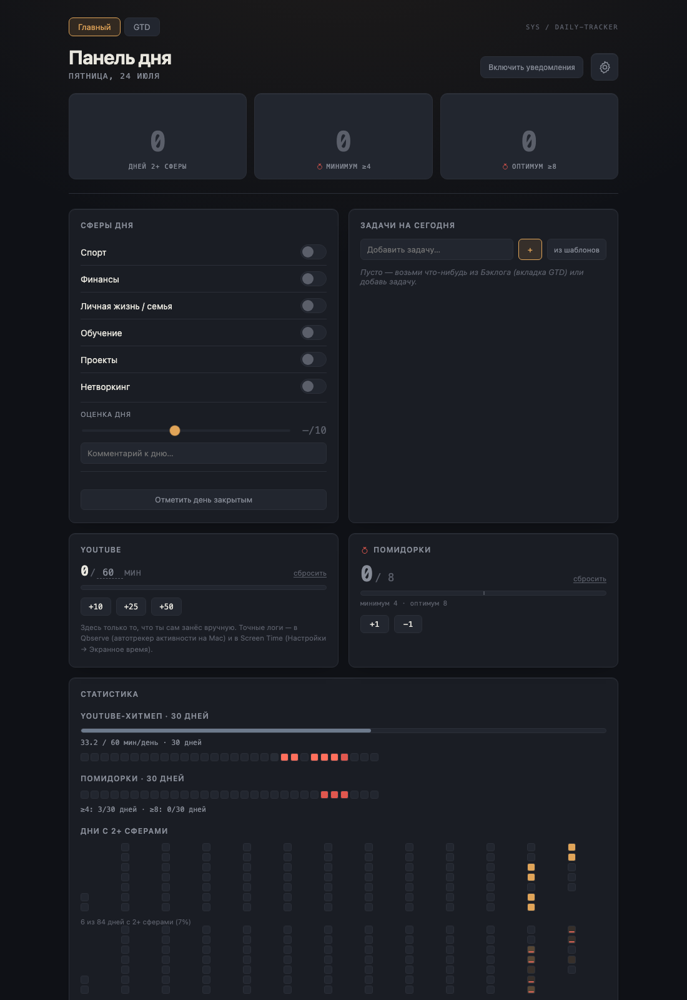
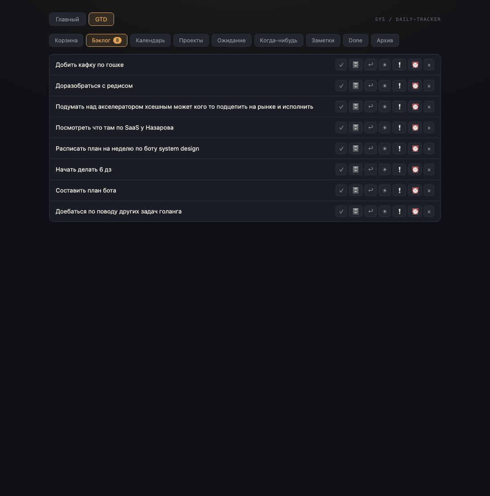

# Дизайн- и продуктовое ревью GTD-трекера — 2026-07-24

**Что ревьюим:** текущее состояние приложения после завершения GTD (ядро + мост + Этап C: Weekly Review, дедлайн/важность, Obsidian-экспорт).

**Метод:** живые скриншоты запущенного стенда (`localhost:4887`, headless Chrome через CDP), плюс разбор реализации. Данные — реальные (Бэклог из 8 задач после схлопывания дублей).

**Скриншоты:**

| Экран | |
|---|---|
| Главный (сферы, «Задачи на сегодня» = GTD-срез, YouTube, помидорки, статистика) |  |
| GTD — Корзина |  |
| GTD — Бэклог (8 пунктов) |  |

---

## 1. Дизайн-ревью

### 🔴 Критично: «иконочный суп» в строках GTD
В Бэклоге у каждой строки **7 кнопок** справа: `✓ 🗄 ↩ ☀ ❗ ⏰ ×`. Проблемы:
- Без подписей (только тултипы) — низкая узнаваемость.
- **Нет визуальной иерархии**: `✓` «готово» и `×` «удалить» выглядят одинаково.
- Эмодзи (`🗄 ⏰ ☀`) **выбиваются из строгой моно-эстетики** остального приложения и рендерятся вразнобой.
- Для ежедневного ритуала на 5–15 минут это трение и визуальный шум.

**Что сделать:** оставить инлайн 1–2 главных действия (`✓ готово`, `☀ в сегодня`), остальное — в overflow-меню «⋯» или показывать по ховеру; заменить эмодзи на единый глиф-набор; `✓` дать акцентный цвет, `×` приглушить (danger-token).

### 🟠 Баг: двойное пустое состояние в Корзине
Одновременно показываются «Пусто.» **и** «Корзина пуста — красота.» — оба empty-state рендерятся (общий в `GtdScreen` + собственный в `InboxProcessor`). Починка — убрать общий empty для бакета `inbox` (одна строка).

### 🟠 Много мёртвого пространства при малых данных
GTD с 8 строками оставляет ~70% экрана пустым; на Home три больших «0» в карточках серий читаются как «пусто/провал». Приложение выглядит голым, пока данных мало.

**Что сделать:** уже́е контейнер списков; для нулевых серий — вперёд-смотрящий текст («начни серию»), а не голый 0.

### 🟡 `window.prompt` для дат
Дедлайн/календарная дата ставятся нативным браузерным диалогом — ломает вылизанный вид. Нужен инлайн date-picker.

### 🟡 Нельзя редактировать пункт из списка
Только двигать/кларифаить, без правки заголовка и заметки. Особенно больно для Заметок: их `notes` уезжают в Obsidian, а удобного редактора текста в приложении нет.

### 🟡 Навигация по 9 корзинам в один ряд
На десктопе влезает, но тесно; счётчик есть только у «Бэклог 8». Показывать счётчики у всех непустых корзин — сразу видно, где разбирать.

---

## 2. Продуктовое / «бизнес» ревью

Собранное — по сути **личная операционная система**: дисциплина (сферы, лимит YouTube, помидорки, серии, оценка дня) + полноценный GTD (захват → воронка → корзины → проекты → weekly review → исполнение «сегодня») + мост в Obsidian. Самохост, один пользователь, приватно.

### Сильные стороны
- **Решает реальную, само-подтверждённую боль** (беговая дорожка переносов — 64% открытых задач по факту из БД). Связка GTD↔день — киллер-фича; мало кто совмещает трекинг-дисциплины и GTD на одном экране.
- **Полный GTD-цикл**, не игрушечный todo: рекурсивные проекты, weekly review, «контексты» через корзины.
- **Obsidian-мост** — залипание в базу знаний.
- **Владение/приватность**, без подписок.

### Риски и дыры
- **🔴 Нет мобильного захвата — самая большая дыра для GTD.** Идеи приходят не за столом; если «скинуть в Корзину» требует открыть localhost на ноуте — inbox не наполняется, и вся система голодает.
- **Триггеры уведомлений зависят от открытой вкладки** (и правильного origin). Не держишь вкладку — напоминания/weekly review не срабатывают.
- **Weekly Review — только пинок**, без сценария: напоминание есть, а самого разбора нет.
- **Заметки трудно вводить в приложении**, хотя именно они экспортируются в Obsidian — рассинхрон.
- **Нет поиска/фильтра по GTD** — Бэклог разрастётся, искать станет тяжело.

---

## 3. Предложения (по приоритету)

| P | Пункт | Почему |
|---|---|---|
| **P0** | **Мобильный quick-capture в Корзину** (PWA «на экран» или iOS-шорткат → `POST /gtd/items`) | Кормит всю систему; без этого GTD голодает |
| **P0** | **Разгрести строки-действия GTD** (инлайн главное + «⋯», единые глифы, иерархия) | Ускоряет ежедневный ритуал, снимает шум |
| **P0** | **Починить двойной empty-state Корзины** | Тривиально, видимый баг |
| **P1** | **Гайд Weekly Review** (чеклист: Корзина→Бэклог→Проекты→Ожидание→Когда-нибудь) | Делает ритуал реальным, а не «напоминанием в никуда» |
| **P1** | **Date-picker** вместо `window.prompt` | Полировка ввода дат |
| **P1** | **Инлайн-редактирование** заголовка/заметки (особенно reference → Obsidian) | Закрывает рассинхрон с экспортом |
| **P1** | Счётчики у всех непустых корзин | Навигация «где разбирать» |
| **P2** | Лучшие пустые/малоданные состояния (серии, мёртвое место GTD) | Ощущение живости при малых данных |
| **P2** | Поиск/фильтр в Бэклоге | Масштабируемость |
| **P2** | Эмодзи → единый глиф-набор; надёжность уведомлений | Консистентность/триггеры |

### Рекомендуемый старт
- **P0.1 (мобильный захват)** — если вопрос «наполнится ли система вообще»; честно самый рычажный.
- **P0.2 + P0.3** — если хочется, чтобы ежедневный экран сразу стал приятнее и быстрее.
