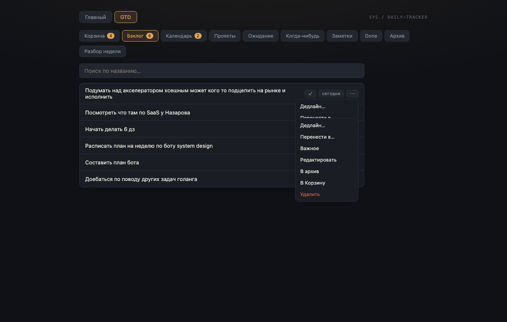

# UX-исследование — 2026-07-24 (взаимодействие, не визуал)

**Что ревьюим:** не как выглядит, а **как оно кликается** — куда жать, где неочевидно, где страшно (destructive-действия без подтверждения), где несогласованные паттерны между экранами. Отдельно от визуального ревью того же дня.

**Метод:** построчное чтение кода интерактивных компонентов (`GtdItemRow`, `InboxProcessor`, `TodayPanel`, `ProjectCard`, `WeeklyReview`, `GtdScreen`) + живые тесты в браузере через CDP (не скриншоты статики, а реальные последовательности действий): удержание фокуса при быстром вводе, поведение при открытии нескольких меню, содержимое карточки проекта.

---

## Главная находка — подтверждена скриншотом

**Несколько меню «⋯» можно открыть одновременно, и они накладываются друг на друга.**

Каждая строка (`GtdItemRow`) хранит своё `menuOpen` полностью независимо — `GtdScreen` никак не координирует «какое меню сейчас открыто». Открыл «⋯» на одной строке, не закрыл — открыл на другой ниже — оба остаются открытыми и визуально перекрывают друг друга:

Это ровно то самое «куда, блядь, кликать» — пункты одного меню читаются сквозь пункты другого, и непонятно, по какому из них реально попадёт клик.

**Фикс:** поднять состояние «какая строка сейчас открыта» на уровень `GtdScreen` (`openMenuId`), при открытии новой — закрывать предыдущую.

---

## Прогон реальных сценариев

### 1. «Быстро накидать 5 мыслей в Корзину подряд»
Проверено живьём: после `Enter` фокус остаётся в поле ввода (`document.activeElement === input` → `true`). Можно печатать и жать Enter не глядя. **Работает хорошо.**

### 2. «Разобрать Корзину подряд, кликая по воронке»
Здесь два реальных источника трения:
- **Список «едет» под курсором.** Как только пункт уходит из Корзины (кликнул финальный ответ воронки), он пропадает из списка, и всё, что было ниже, поднимается на его место. Если кликать быстро по нескольким пунктам подряд (а сама воронка к этому и подталкивает), следующий клик может попасть уже на **другой**, сдвинувшийся пункт — а не на тот, что был там секунду назад.
- **Нет шага «назад».** У каждого вопроса воронки только два типа ответа: «дальше» (следующий вопрос) или «финиш» (пункт улетает в корзину-статус). Если промахнулся кликом посреди воронки (например, ответил «Да» вместо «Нет» на «Делать мне?»), откатить нельзя — только идти искать пункт в том бакете, куда он попал по ошибке, и вручную возвращать «В Корзину» через меню «⋯», чтобы пройти воронку заново.

### 3. «Поставить дедлайн» vs «Перенести в Календарь»
Один и тот же виджет (`DatePicker`), но **два разных сценария подтверждения**:
- «Дедлайн…» → выбрал дату → применяется **сразу**, меню закрывается.
- «Перенести в… → Календарь» → выбрал дату (и опционально время) → нужно **ещё нажать «OK»** отдельной кнопкой.

Если человек привык к первому паттерну (выбрал — applied), при переносе в календарь будет ощущение «я же выбрал дату, почему ничего не произошло» — а потому что тут нужен ещё один клик.

### 4. «Удалить лишний пункт»
**Нет подтверждения удаления нигде в GTD** (ни в меню строки, ни на «Сегодня»). Один клик по «Удалить» — пункт исчезает без возможности отмены. «Удалить» и «В архив» — соседние пункты одного и того же текстового меню, отличаются только цветом текста. Промахнуться между ними — реалистичный сценарий, и цена ошибки — безвозвратная потеря (в отличие от «В архив», откуда можно восстановить).

### 5. «Отметить проект: у него точно всё по плану?»
Открыл карточку проекта → видишь список шагов → **шаги не кликабельны**. Нельзя отметить готово, отредактировать или удалить шаг прямо в карточке — только посмотреть текст. Чтобы что-то сделать с шагом, нужно закрыть карточку, вспомнить, в какой бакет воронка его определила, найти его там по названию. Для «фишки проекта» (рекурсивные шаги) это существенно режет удобство.

Плюс: статус шага показан как есть — `{c.status}` без перевода, то есть буквально **`backlog`, `inbox`, `done`** латиницей посреди русского интерфейса. Единственное место в приложении, где это происходит.

### 6. «Сегодня» vs GTD-строка — разная мышечная память
На «Сегодня» (`TodayPanel`) клик по **тексту** задачи тоже отмечает done — не только по галочке. В GTD-списке (`GtdItemRow`) текст ничего не делает (для проектов — открывает карточку), работает только маленькая кнопка `✓`. Один и тот же паттерн «список задач с галочкой» ведёт себя по-разному в двух местах приложения.

### 7. «Кому это передал?» — единственный оставшийся `window.prompt`
Ветка Ожидание в воронке Корзины («Делать мне? → Нет») до сих пор спрашивает имя через нативный `window.prompt()` — тот самый браузерный алерт, который выбивается из всего остального интерфейса. Даты в этой самой воронке уже получили красивый свой календарь; «кому делегировано» — нет (сознательно не трогал в тот раз, теперь всплыло как несостыковка).

### 8. Закрытие меню/попапов — три разных поведения в одном приложении
- `DayDetailModal`, `WeeklyReview` — закрываются по **Escape** и клику вне.
- `DatePicker`-попап — закрывается по клику вне, но **не** по Escape.
- Меню строки «⋯» (`GtdItemRow`), дропдаун «из шаблонов» (`TodayPanel`/`DailiesPanel`-стиль) — **не закрываются** ни по Escape, ни по клику вне; только повторным кликом по той же кнопке-тогглеру или явным действием внутри.

Три разных модели закрытия для визуально одинаковых «всплывающих штук» — то, что интуитивно должно работать одинаково, работает по-разному в зависимости от того, где кликнул.

---

## Сводная таблица находок

| # | Находка | Серьёзность | Где |
|---|---|---|---|
| 1 | Несколько меню «⋯» открываются одновременно, перекрываются | 🔴 Критично | `GtdScreen`/`GtdItemRow` |
| 4 | Удаление без подтверждения и без отмены | 🔴 Критично | везде в GTD, `TodayPanel` |
| 2 | Список «едет» под курсором при быстрой обработке Корзины | 🟠 Важно | `InboxProcessor` |
| 2 | Нет «назад» в воронке разбора | 🟠 Важно | `InboxProcessor` |
| 3 | Дедлайн применяется сразу, перенос в Календарь требует доп. клик «OK» | 🟠 Важно | `GtdItemRow` |
| 5 | Шаги проекта не кликабельны — нельзя управлять ими из карточки | 🟠 Важно | `ProjectCard` |
| 5 | Статус шага — сырой английский идентификатор без перевода | 🟠 Важно | `ProjectCard` |
| 6 | Клик по тексту тоглит done на «Сегодня», но не в GTD-строке | 🟡 Полировка | `TodayPanel` vs `GtdItemRow` |
| 7 | `window.prompt()` для «Кому делегировано» — выбивается из стиля | 🟡 Полировка | `InboxProcessor` |
| 8 | Три разных модели закрытия попапов (Escape/клик-вне/только тоггл) | 🟡 Полировка | по всему приложению |

---

## Предложения (по приоритету)

| P | Пункт | Что даёт |
|---|---|---|
| **P0** | Одно открытое меню строки за раз (поднять состояние в `GtdScreen`) | Убирает самый явный «куда кликать» баг |
| **P0** | Подтверждение (или хотя бы «отменить», всплывающее на пару секунд) перед «Удалить» | Убирает риск необратимой потери от промаха мышкой |
| **P1** | Единая модель подтверждения для выбора даты — дедлайн и календарь должны вести себя одинаково (либо оба applied-on-pick, либо оба через «OK») | Убирает «я же выбрал, почему не сработало» |
| **P1** | Шаги проекта — сделать кликабельными (открывать `GtdItemRow`-подобные действия прямо в карточке) + перевести статус на русский | Возвращает удобство ключевой фиче (рекурсивные проекты) |
| **P1** | Кнопка «назад» на один шаг в воронке разбора Корзины | Даёт отыграть промах не выходя из потока |
| **P2** | Единая модель закрытия попапов — Escape и клик-вне везде одинаково | Меньше сюрпризов, но не критично |
| **P2** | Заменить последний `window.prompt` (waitingFor) на инлайн-поле | Долечивает несостыковку после замены дат на свой календарь |
| **P2** | Синхронизировать клик-по-тексту между «Сегодня» и GTD-строкой | Мелкая, но снимает путаницу мышечной памяти |

### Рекомендуемый старт
**P0 (оба пункта)** — самое дешёвое и самое заметное: убирает единственный по-настоящему пугающий момент (безвозвратное удаление) и единственный визуально сломанный момент (наложение меню), которые прямо соответствуют твоей формулировке «куда, блядь, кликать».
